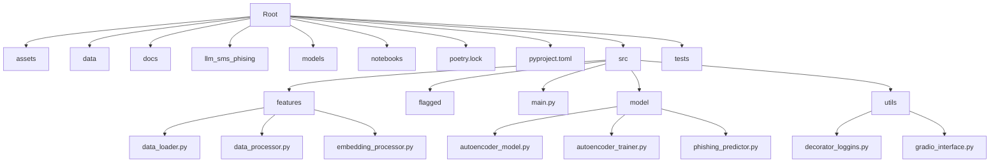

# Phishing Detection using Autoencoder and DistilBERT

Este proyecto tiene como objetivo detectar correos electrónicos de phishing utilizando una combinación de un autoencoder y DistilBERT.

## Estructura del Proyecto



## Estructura del Proyecto

\```
├── README.md
├── assets
├── data
├── docs
├── llm_sms_phising
├── models
├── notebooks
├── poetry.lock
├── pyproject.toml
├── src
│   ├── features
│   │   ├── data_loader.py
│   │   ├── data_processor.py
│   │   └── embedding_processor.py
│   ├── flagged
│   ├── main.py
│   ├── model
│   │   ├── __pycache__
│   │   ├── autoencoder_model.py
│   │   ├── autoencoder_trainer.py
│   │   └── phishing_predictor.py
│   └── utils
│       ├── decorator_loggins.py
│       └── gradio_interface.py
├── tests
\```

## Requisitos

- Python 3.12
- Pytorch
- Transformers
- SentenceTransformers
- Gradio
- Pandas
- NumPy

Puedes instalar las dependencias utilizando Poetry:
\```bash
poetry install
\```

## Instrucciones de Uso

### Entrenamiento del Autoencoder y DistilBERT

Asegúrate de que los modelos estén entrenados y guardados en la carpeta `models`.

### Ejecución del Proyecto

Para iniciar la interfaz de detección de phishing, ejecuta el archivo `main.py`:
\```bash
poetry run python src/main.py
\```

### Descripción de Archivos

- **main.py**: Punto de entrada del proyecto. Configura y lanza la interfaz de Gradio.
- **model/phishing_predictor.py**: Contiene la clase `PhishingPredictor` que realiza la predicción de phishing utilizando un autoencoder y DistilBERT.
- **utils/decorator_loggins.py**: Proporciona decoradores para el registro de la ejecución y los errores.
- **utils/gradio_interface.py**: Configura la interfaz de Gradio para la detección de phishing.
- **features/data_loader.py**: Carga y prepara los datos.
- **features/data_processor.py**: Procesa los datos para el modelo.
- **features/embedding_processor.py**: Genera embeddings a partir de los datos.

### Interfaz de Gradio

La interfaz de Gradio permite introducir un mensaje y obtener la predicción de si es phishing o no, junto con las confianzas del autoencoder y DistilBERT.
\```

Esto asegura que todo el contenido esté dentro de un solo bloque de código en tu `README.md` y refleja correctamente la estructura y uso del proyecto.
